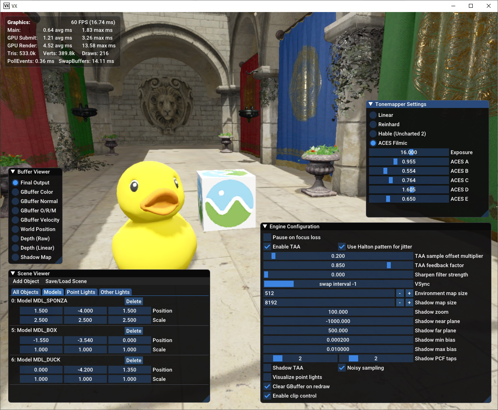

## VX

Simple 3D engine. Currently little more than a model viewer, with partial support for glTF and Unreal-style PBR.

Current download links:

* Windows 64-bit: https://github.com/xndc/vx/releases/download/v1.0/vx-1.0-win64.zip (56.1 MB)
* Source code: https://github.com/xndc/vx/archive/master.zip

Keyboard shortcuts:

* **Tilde/backtick** [~] opens a basic Unity-style stats display.
* **Ctrl+P** opens the engine configuration panel.
* **Ctrl+O** opens the very primitive scene/object viewer and editor.
* **Ctrl+V** opens a buffer viewer, letting you take a look at the various render buffers.
* **Ctrl+T** opens the tonemapper configuration panel.

Build instructions:

* Windows: run `scripts/build.ps1 -run` to build & run with MSVC 2017, or `scripts/build.ps1 -clang -run` to download and use LLVM/Clang.
* Linux and macOS: run `scripts/build.sh -run`.
* CMake and Python are required.

VX will decompress and cache textures during the first run. This may take up to 30 seconds and will currently use around 60 MB of disk space.

